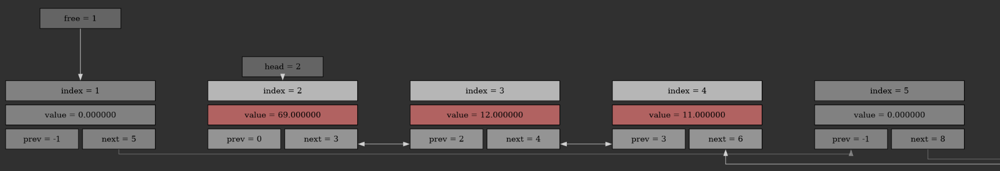

<h1 align="left">Processor (DREC TASK)</h1>

###

  

###

###

This library provides you access to fast and safe data struct named "list".

###

<h2 align="left">Memory Usage (DREC TASK)</h2>

###

|Function name| Description |
| --- | --- |
|list_return_e InitList(list_t** list, size_t start_list_size)| initialize pointer to struct list_t with element capacity of start_list_size |
|list_return_e DestroyList(list_t** list)|safely destroy struct list_t|

###

<h2 align="left">List Usage (DREC TASK)</h2>

###

|Function name| Description |
| --- | --- |
|list_return_e ListAddElement(list_t* list, data_type value)| adding element to the end of the list |
|list_return_e ListAddAfterElement(list_t* list, data_type value, int index)|adding element after index_elem|
|list_return_e ListDeleteElement(list_t* list, size_t  index)|deleting index_elem|
|list_return_e GetElementValue(list_t* list, size_t element_index, data_type* value)| get value of index_elem|
|ssize_t GetNextElement(list_t* list, size_t element_index)| get index of element which is located after index_elem|
|ssize_t GetPreviousElement(list_t* list, size_t element_index)|get index of element which is located before index_elem|
|ssize_t GetHeadElement(list_t* list)| get index of the first element in list|
|ssize_t GetTailElement(list_t* list)| get index of the last element in list|

###

<h2 align="left">Code example (DREC TASK)</h2>

###

'''bash
list_t* list = NULL;

InitList(&list, 2);
ListAddElement(list, 12);
ListAddAfterElement(list, 69, 0);
ListAddElement(list, 12);
ListAddElement(list, 11);
ListAddElement(list, 25);
ListAddElement(list, 32);
ListAddElement(list, 2);
ListDeleteElement(list, 5);
ListDeleteElement(list, 1);

DestroyList(&list);

'''

